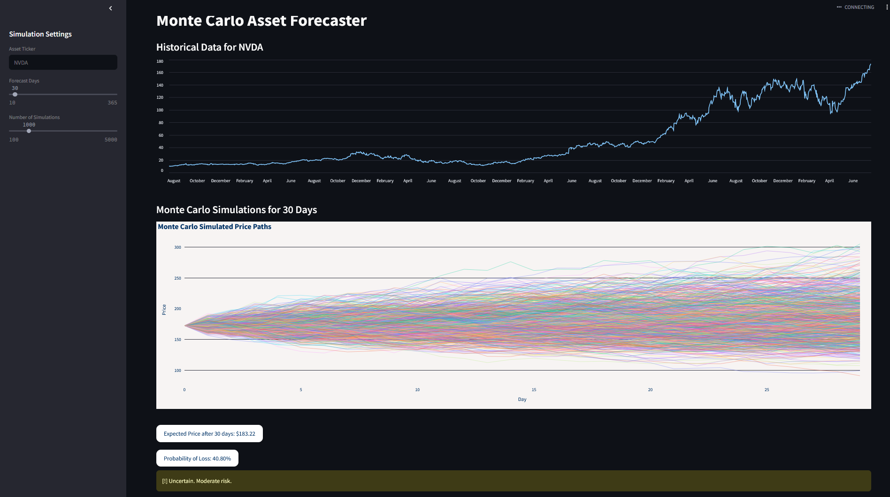

# 📈 Monte Carlo Stock Simulator

A **Streamlit** app to simulate future stock price movements using **Monte Carlo simulations**, based on historical stock data from [Yahoo Finance](https://finance.yahoo.com/) via `yfinance`.

---


## 🚀 Features

- 🎲 Monte Carlo simulations for any stock with available `yfinance` data
- 📊 Visualized results using **Plotly**
- 📉 Calculates expected future price and probability of loss

---

## 🛠️ Future Additions

Coming soon:

- 🧠 **Neural Network-based price simulations**
- 🗾 **NLP analysis of company news and financial filings**
- 📄 **10-K Statement Analysis** using a fine-tuned LLM to extract:
  - Intrinsic value
  - Business outlook
  - Risks and opportunities

---

## 🧪 Requirements

Before running, install the following Python packages:

```bash
pip install plotly streamlit numpy pandas yfinance
```

---

## 💻 How to Use

1. **Clone the repository**

```bash
git clone https://github.com/ONEWHOCANREAD/quant_sim
cd quant_sim
```

2. **Switch to the main branch** *(if not default)*

```bash
git checkout main
```

3. **Run the app using Streamlit**

```bash
streamlit run app.py
```

---

## 📌 Notes

- This app uses daily adjusted closing prices pulled from `yfinance`
- By default, it runs **1000 simulations for 30 days** into the future
- Results are purely statistical and should not be used as financial advice

---

## 🧠 About

This app was created as a foundation for a full-featured **AI-driven stock research platform** combining simulation, machine learning, and natural language processing.

